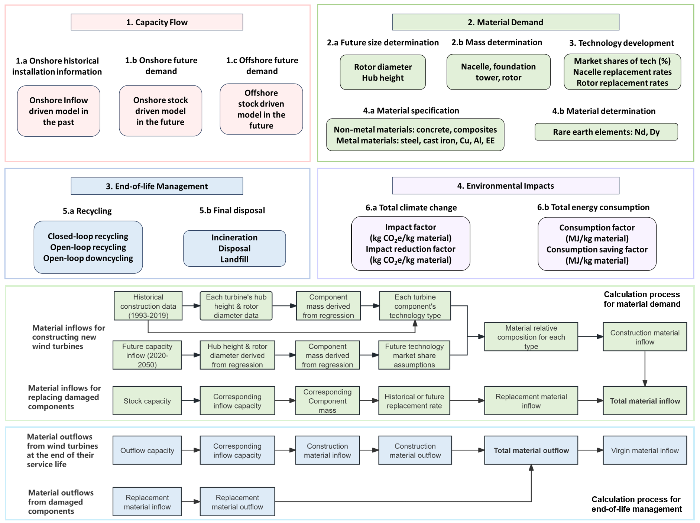

## 🌐 Read the full article published in RCR here: https://doi.org/10.1016/j.resconrec.2024.108094
## 📺 Explore the model walkthrough & setup video here: https://youtu.be/LwH4sxwiwFk
# CAwindMFA
Canadian wind energy dynamic material flow analysis (dMFA)

This model presented a comprehensive analysis of capacity flow, material demand, EoL (end-of-life) management, and the environmental impact of material production for onshore wind turbines in Canada from 1993 to 2050 and offshore wind turbines from 2020 to 2050. The analysis examined four wind turbine components: foundation, nacelle, rotor, and tower. Several material types were covered in this study, including non-metal materials such as concrete and composites, metals (e.g.,steel, cast iron, copper (Cu), aluminum (Al)), and electrics/electronics (EE), as well as REEs in permanent magnets (e.g., neodymium (Nd) and dysprosium (Dy)). 

# How to Run the Project

## Prerequisites

- Python 3.11.9
- Git Bash (for Windows users)
- Required Python packages listed in `requirements.txt`

## Setup Instructions
### Clone the repository: Open a terminal (or Git Bash for Windows users) and run the following command to clone the project:

git clone https://github.com/Peijin-Jiang/CAwindMFA

cd CAwindMFA

### Use the following command to install the required Python packages:

pip install -r requirements.txt

### Once you're in the project directory, run the following command to execute all experiments:

bash run_all_experiments.sh

# Model Overview

# Scenarios
- capacity flow: 2 energy demand scenarios (GCAM: Global Change Analysis Model and GNZ: Global Net Zero from Canada Energy Regulator)
- material demand: 2 energy demand scenarios * 3 tech devlopment scenarios (CT: conventional technology, AT: advanced technology, NT: new technology)
- material EoL: 2 energy demand scenarios * 3 tech devlopment scenarios * 2 EoL scenarios (EoL_C: current EoL treatment, EoL_O: optimistic EoL treatment)
- material production (cradle-to-gate) environmental impact: 2 energy demand scenarios * 3 tech devlopment scenarios * 2 EoL scenarios 

# Model Configuration (parameter settings)

## Modifications in Excel File (input_data/Wind_data.xls)
The following data can be modified directly in the Excel sheets to adapt the model for other regions:

1.	Wind Energy Demand Scenarios:
•	Onshore: sheet_name='on_capacity'
•	Offshore: sheet_name='off_capacity'
•	Update these sheets for country-specific scenarios, including future onshore and offshore wind energy demand, capacity factors, curtailment rate and average wind turbine capacity.
2.	Technological Development Scenarios:
•	Sheet: sheet_name='tech_dev'
•	Contains technological development scenarios, such as changes in market share, replacement rates, and lifetime assumptions for both onshore and offshore turbines.

3.	Material Composition Data:
•	Onshore: sheet_name='on_material'
•	Offshore: sheet_name='off_material'
•	Adjust these sheets for material compositions of turbine components

4.	End-of-Life (EoL) Scenarios:
•	Sheet: sheet_name='recy_rate_new'
•	Define specific EoL treatment proportions for different recycling or disposal methods.

5.	Climate Impact and Energy Consumption Factors:
•	Sheet: sheet_name='envir_impact'
•	Modify this sheet to set climate impact and energy consumption factors for materials, as well as potential reductions achievable through closed-loop recycling.

6.	Historical Data:
•	Sheet: sheet_name='historical_info'
•	This sheet includes historical construction year, capacity, and the type of nacelle and tower used in each wind turbine. Update this data to reflect the historical specifications of wind turbines in the region of interest.

## Modifications in Python Code
Certain model parameters and relationships are hardcoded in the Python scripts and require changes in the code if adapting for another region:

1.	Wind Turbine’s Weibull Shape Factor:
•	Adjustments to the Weibull shape factor need to be made in the a_capacity_flow.py script.

2.	Regression Results for Capacity and Dimensions Relationship:
•	If a new relationship between turbine capacity and physical dimensions is required, it needs to be updated in b_offshore_material.py and b_onshore_material.py.
	
3.	Component Mass Relationships:
•	To adapt a new relationship between turbine dimensions and component mass, changes should be made in the _utils.py script.

